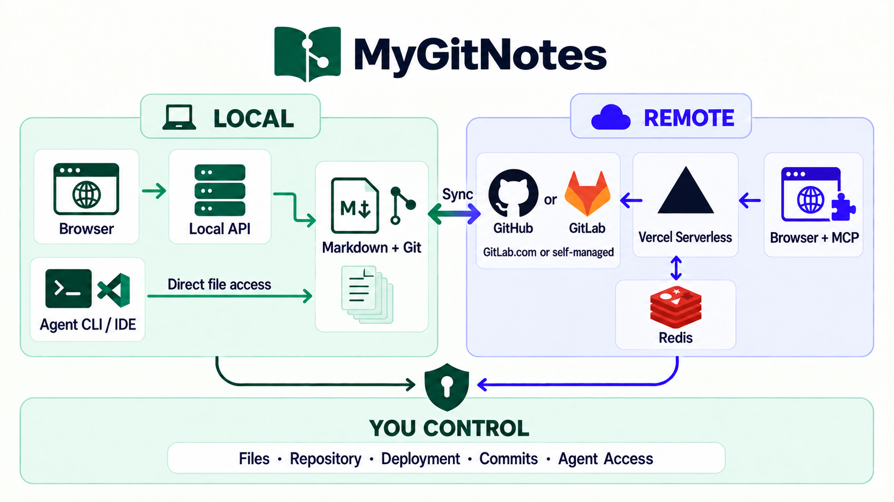

# MyGitNotes

A high-density, local-first document interface with Git-native storage and a remote serverless MCP powered by GitHub or GitLab and Vercel.

Your Markdown, repository, deployment, commit history, and agent access remain under your control.

[English](README.md) · [繁體中文](README.zh-TW.md)

[Live Demo](https://my-gh-core.vercel.app) · [Example Repository](https://github.com/wayne930242/MyGitNotes/tree/main)

## What it is

MyGitNotes turns a Git repository into a focused workspace for notes, documents, assets, and AI agents. You work through a purpose-built note UI while Markdown files, Git history, and repository permissions remain the source of truth.

It runs in two modes:

- **Local:** the UI reads and writes your local repository directly.
- **Remote:** Vercel serves the UI and a serverless MCP endpoint; GitHub or GitLab stores the files and commit history.

The same workspace can therefore stay fully local, travel through Git, or be securely accessed from a browser and MCP clients without operating a permanent server.

## Core features

- **High-density note UI:** List, Card, and Kanban views; full-text search; tags and statuses; nested folders; folder index cards; Markdown editing with live preview; asset management; responsive desktop and mobile layouts.
- **Screen:** arrange notes, folders, images, and YouTube videos into reading lanes across notebooks. Dynamic lanes can follow a tag or folder.
- **Pure Markdown:** notes remain ordinary `.md` files with optional YAML frontmatter. Existing Markdown and unknown metadata survive round trips.
- **Git-native workflow:** local edits save to disk; selected changes are committed explicitly. Remote writes use revision checks and non-forced commits to reject stale updates.
- **Local and remote sources:** open a local checkout or a configured GitHub or GitLab repository through the same interface.
- **Local and hosted MCP:** connect agents through local stdio or Vercel-hosted Streamable HTTP to list, read, search, create, edit, move, and commit workspace content.
- **Controlled agent access:** create named read-only or write grants, copy the connection URL once, and revoke each grant at any time.
- **Safe product updates:** product code lives on `core`; personal workspace content lives on `main`. Core updates preserve `notes/**` and workspace-owned Agent settings.

## Design logic



The boundaries are intentional:

- **Markdown owns the content.** There is no proprietary note database to export from.
- **Git owns history and publication.** You choose what to commit and can inspect or revert every change.
- **GitHub or GitLab owns remote persistence.** Vercel provides the interface and serverless transport; Redis stores sessions and MCP grants, not notes.
- **You own the system boundary.** You choose the repository, branch, deployment, credentials, Core updates, and every agent grant.
- **The UI and agents share the same rules.** Path guards, branch guards, revision checks, and repository permissions apply to both.

## Why combine both sides

The market usually treats these as separate product models:

- **Local-first, like [Obsidian](https://obsidian.md/blog/free-your-notes/):** ordinary files on your device, offline access, and direct editing from an IDE, CLI, or local agent.
- **Cloud-document, like [Craft](https://support.craft.do/en/account-and-subscription/data-and-security/data-storage) or [Notion](https://www.notion.com/help/notion-for-web):** a polished browser and multi-device experience with automatic sync, sharing, and remote collaboration.

Even products that support both models often present them as alternatives. Craft, for example, supports local [External Locations](https://support.craft.do/en/account-and-subscription/storage-and-recovery/external-locations), but sharing and collaboration are unavailable there.

MyGitNotes connects both interfaces to the same Markdown and Git workspace. The local UI and local agents edit the files directly; Git syncs them to GitHub or GitLab; Vercel exposes the same repository through a high-density remote note UI and serverless MCP. There is no second cloud copy to export, import, or reconcile.

## Repository model

- **`core`** — product source, packages, tests, scripts, and documentation. It contains no personal notes.
- **`main`** — your workspace branch containing `.github-notes.yaml`, `notes/**`, assets, and workspace Agent configuration.

This separation lets the application evolve without taking ownership of your content.

## Quick start

Requires Node.js 22+, pnpm 9+, and Git.

```bash
git clone <repository-url> mygitnotes
cd mygitnotes
pnpm install
pnpm build
pnpm bootstrap-workspace
pnpm dev
```

Open [http://localhost:5173](http://localhost:5173). The development commands use the local repository and do not require GitHub sign-in.

To open another checkout:

```bash
REPO_ROOT=/absolute/path/to/workspace pnpm dev
```

To update an existing workspace from the product branch:

```bash
git remote add upstream <product-repository-url>
pnpm update-core
```

## Remote deployment and serverless MCP

Deploy the `main` branch to your own Vercel project. The included [`vercel.json`](vercel.json) builds the web app and routes `/api/*`, `/mcp/*`, and `/raw-assets/*` to the serverless API.

You need:

1. A GitHub OAuth App with callback URL `https://<your-project>.vercel.app/api/auth/github/callback`.
2. An Upstash Redis database for encrypted browser sessions and persistent MCP grants.
3. These Vercel environment variables:

```bash
MYGITNOTES_SOURCE=github
MYGITNOTES_REPOSITORY=your-username/your-repository
MYGITNOTES_BRANCH=main

APP_URL=https://<your-project>.vercel.app
GITHUB_CLIENT_ID=your_oauth_client_id
GITHUB_CLIENT_SECRET=your_oauth_client_secret
GITHUB_APP_TYPE=oauth-app
SESSION_SECRET=your_random_secret_of_at_least_32_characters

UPSTASH_REDIS_REST_URL=https://...upstash.io
UPSTASH_REDIS_REST_TOKEN=your_upstash_redis_token
# Optional for a new deployment sharing Redis
MYGITNOTES_SESSION_NAMESPACE=your_unique_deployment_name
```

After deployment, sign in with GitHub. Under **Settings → MCP Access Control**, create a read-only or write grant and paste the generated `/mcp/<token>` URL into ChatGPT, Claude, Cursor, Windsurf, or another MCP client.

Standard GitHub OAuth Apps request the `repo` scope so authenticated owners can read and write private repositories. MCP grants remain scoped to the configured repository and can be revoked individually.

## GitLab deployment

Each deployment selects one provider, site, project and branch. Use the same build and Redis settings as above, with these source and OAuth values:

```bash
MYGITNOTES_SOURCE=gitlab
MYGITNOTES_REPOSITORY=group/subgroup/project
MYGITNOTES_BRANCH=main
MYGITNOTES_GITLAB_URL=https://gitlab.com
GITLAB_CLIENT_ID=your_application_id
GITLAB_CLIENT_SECRET=your_application_secret
```

For self-managed GitLab, set `MYGITNOTES_GITLAB_URL` to its HTTPS base URL, including an installation subpath when applicable. The deployment must be able to reach that site and trust its TLS certificate. Register an OAuth application on the selected site with the `api` scope and callback `${APP_URL}/api/auth/gitlab/callback`. The UI uses GitLab sign-in automatically. Access and refresh tokens remain encrypted on the server; persistent MCP grants share the refreshed credential.

Authenticated writes require push permission on `main`. GitLab batches all changed files into one commit and supplies each existing file's last commit ID to detect concurrent edits. Public repositories support anonymous reads. GitLab instances with private network access require a deployment with network access to that instance.

The product is now **MyGitNotes**. Existing `.github-notes.yaml`, Screen/Study sidecars, `@github-notes/*` packages, GitHub OAuth callbacks and MCP grants remain compatible. New `MYGITNOTES_*` source settings take precedence over corresponding `GITHUB_NOTES_*` settings. `mygitnotes.server.yaml` is the new server configuration filename; `github-notes.server.yaml` remains supported. The canonical repository is `wayne930242/MyGitNotes`; deployment URLs are unchanged. Update configured repository paths directly after a rename. MCP grants bound to a previous repository path require a new grant.

See [GitLab OAuth](https://docs.gitlab.com/api/oauth2/) and [commit actions](https://docs.gitlab.com/api/commits/).

## Documentation

- [Agent and developer documentation](docs/agent/index.md)
- [Architecture](docs/agent/architecture/index.md)
- [MCP interface and security model](docs/agent/mcp/index.md)
- [Demo workspace](examples/demo-workspace/README.md)

## License

MIT
