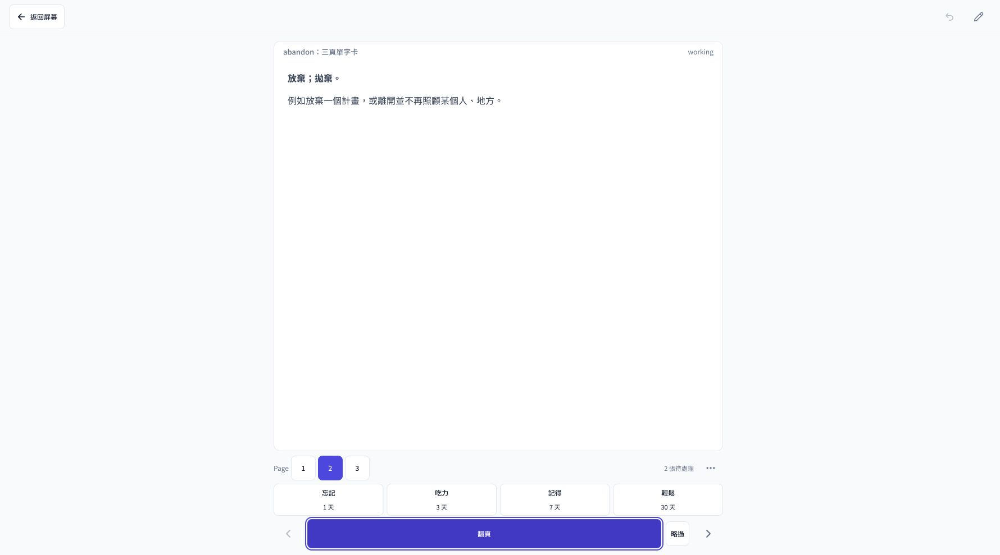
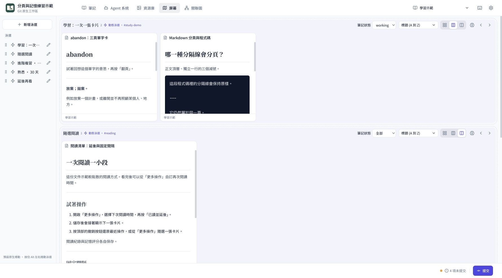
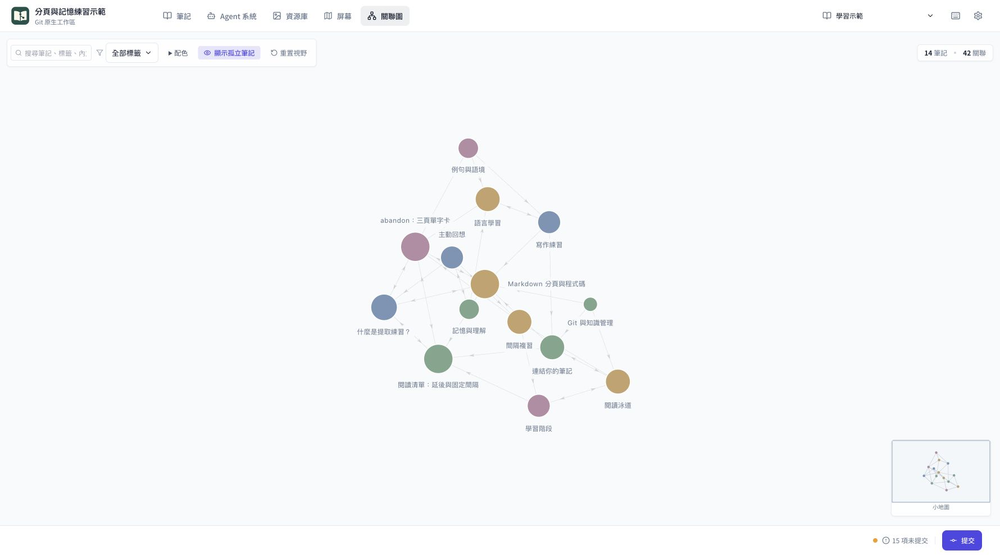

# MyGitNotes

A high-density, local-first workspace for Markdown notes, flashcard learning, reading screens, and knowledge graphs. Keep your data in Git and deploy with Docker, Docker Compose, or Vercel.

Your Markdown, repository, deployment, commit history, and agent access remain under your control.

[English](README.md) · [繁體中文](README.zh-TW.md)

[Live Demo](https://my-gh-core.vercel.app) · [Flashcard Learning Demo](https://my-gh-core.vercel.app/screen/lanes/explore) · [Example Repository](https://github.com/wayne930242/MyGitNotes/tree/main)

## Design logic


The boundaries are intentional:

- **Markdown owns the content.** There is no proprietary note database to export from.
- **Git owns history and publication.** You choose what to commit and can inspect or revert every change.
- **GitHub or GitLab owns remote persistence.** Docker / Compose or Vercel provides the interface and MCP transport. Compose runs its own Redis with a persistent volume for encrypted sessions and MCP grants. Docker alone can use native Redis or a session volume; Vercel uses Redis REST. Notes stay in Git.
- **You own the system boundary.** You choose the repository, branch, deployment, credentials, Core updates, and every agent grant.
- **The UI and agents share the same rules.** Path guards, branch guards, revision checks, and repository permissions apply to both.

## Why combine both sides

The market usually treats these as separate product models:

- **Local-first, like [Obsidian](https://obsidian.md/blog/free-your-notes/):** ordinary files on your device, offline access, and direct editing from an IDE, CLI, or local agent.
- **Cloud-document, like [Craft](https://support.craft.do/en/account-and-subscription/data-and-security/data-storage) or [Notion](https://www.notion.com/help/notion-for-web):** a polished browser and multi-device experience with automatic sync, sharing, and remote collaboration.

Even products that support both models often present them as alternatives. Craft, for example, supports local [External Locations](https://support.craft.do/en/account-and-subscription/storage-and-recovery/external-locations), but sharing and collaboration are unavailable there.

MyGitNotes connects both interfaces to the same Markdown and Git workspace. The local UI and local agents edit the files directly; Git syncs them to GitHub or GitLab; a self-hosted container or Vercel exposes the same repository through a high-density remote note UI and HTTP MCP. There is no second cloud copy to export, import, or reconcile.

## What it is

MyGitNotes turns a Git repository into a focused workspace for notes, documents, assets, and AI agents. You work through a purpose-built note UI while Markdown files, Git history, and repository permissions remain the source of truth.

It runs in two modes:

- **Local:** the UI reads and writes your local repository directly.
- **Remote:** Docker / Docker Compose or Vercel serves the UI and an HTTP MCP endpoint; GitHub or GitLab stores the files and commit history.

The same workspace can stay fully local, travel through Git, or be accessed from a browser and MCP clients. Choose a self-hosted Node.js container or a serverless deployment to suit your infrastructure.

## Repository model

- **`core`** — product source, packages, tests, scripts, and documentation. It contains no personal notes.
- **`main`** — your workspace branch containing `.mygitnotes.yaml`, `notes/**`, assets, and workspace Agent configuration.

This separation lets the application evolve without taking ownership of your content.

## Files

The **Files** page and file manager dialog manage directories, Markdown notes, UTF-8 text files, and attachments within the selected notebook. Create empty text files, edit source with syntax highlighting, upload and preview attachments, or rename, move, and delete files. Hidden files are off by default. Folder information and the `index.md` entry point share this interface.

Notes have a **Move** action in list, card, kanban, and editor views. **Insert image** opens the same browser in read-only selection mode. Moves update Markdown links and Screen / Study references while retaining attachment hashes and study identities.

Local changes remain in the working tree until you use Commit. GitHub and GitLab operations create revision-checked atomic commits. Uploads support 3 MiB; file reads and changed content support 5 MiB, with up to 200 changed files per operation. Operations load at most 32 MiB of affected files and reference documents; browsing does not load every file's contents.

## Quick start

Requires Node.js 22+, pnpm 9+, and Git. (On pnpm 10+, dependency build scripts are configured via `allowBuilds` in `pnpm-workspace.yaml` or `pnpm approve-builds`).

```bash
git clone <repository-url> mygitnotes
cd mygitnotes
pnpm install
pnpm build              # Compiles @mygitnotes packages required by local-server
pnpm bootstrap-workspace  # Add --no-examples for an empty workspace; prints Vercel deploy steps
pnpm dev
```

To deploy the workspace to Vercel, follow the steps bootstrap prints or [Vercel deployment](#vercel-deployment-optional).

Open [http://localhost:5173](http://localhost:5173). The development commands use the local repository and do not require GitHub sign-in.

To open another checkout:

```bash
REPO_ROOT=/absolute/path/to/workspace pnpm dev
```

To update an existing workspace from the product branch:

```bash
git remote add upstream <product-repository-url>
pnpm update-core
```

## Docker and Docker Compose deployment

The container serves the built web UI, API, assets, and Streamable HTTP MCP on port `4321`. It supports local, GitHub, and GitLab sources. Build from the product checkout; remote notes stay in your selected workspace repository and branch.

### Remote repository with Docker Compose

```bash
cp docker.env.example .env.docker
# Edit .env.docker: repository, APP_URL, OAuth credentials, SESSION_SECRET.
# Generate SESSION_SECRET once with: openssl rand -hex 32

docker compose up -d --build
docker compose logs -f mygitnotes
```

Compose starts both MyGitNotes and Redis, waits for Redis health, and connects over an internal network using `REDIS_URL=redis://redis:6379`. Redis uses append-only persistence on the `redis-data` volume and has no published host port. This deployment needs no Upstash account.

Open [http://localhost:4321](http://localhost:4321). For public access, route your HTTPS reverse proxy to `127.0.0.1:4321`, preserve the public Host header, and set `APP_URL=https://notes.example.com`. Register `${APP_URL}/api/auth/github/callback` with your GitHub OAuth App, or use the [GitLab settings](#gitlab-deployment) below. Forward all paths, including `/api/*`, `/mcp/*`, `/raw-assets/*`, and `/r2-assets/*`, and allow streamed MCP responses. A proxy running in another container should share the application network and forward to `mygitnotes:4321`.

Compose publishes the port on localhost. Set `MYGITNOTES_PORT` to change the host port and update `APP_URL` to the URL used by your browser. Set `MYGITNOTES_ENV_FILE` to use a different environment file. Sign in and create a connection under **Settings → MCP Access Control** to use `${APP_URL}/mcp/<token>`.

### Remote repository with Docker

Use the same `.env.docker` file:

```bash
docker build -t mygitnotes:local .
docker volume create mygitnotes-sessions
docker run -d --name mygitnotes --init --restart unless-stopped \
  -p 127.0.0.1:4321:4321 \
  --env-file .env.docker \
  --mount type=volume,source=mygitnotes-sessions,target=/app/.github-notes-sessions \
  mygitnotes:local
```

### Local checkout in a container

Use an existing workspace checkout on `main`, with `.mygitnotes.yaml` and your notes. The container runs as UID/GID `1000:1000`; give that user read/write access to the mounted checkout on Linux and configure a Git author in the workspace for commits (`git config user.name` and `git config user.email`).

```bash
WORKSPACE_PATH=/absolute/path/to/workspace \
  docker compose -f compose.local.yaml up -d --build
```

Or run the image directly:

```bash
docker run -d --name mygitnotes-local --init --restart unless-stopped \
  -p 127.0.0.1:4321:4321 \
  -e MYGITNOTES_SOURCE=local -e MYGITNOTES_LOCAL_PATH=/workspace \
  -e APP_URL=http://localhost:4321 \
  --mount type=bind,source=/absolute/path/to/workspace,target=/workspace \
  mygitnotes:local
```

Open `http://localhost:4321`. Local mode is an anonymous desktop workflow restricted to loopback hosts; for an internet-facing site, select GitHub or GitLab with OAuth. Local edits and Screen/Study YAML files persist in the mounted checkout. Commit and sync (pull with rebase, then push) from the Changes panel; configure remote Git credentials separately when needed.

### Persistence and updates

Compose stores encrypted sessions, provider credentials, and MCP grants in its own Redis. Back up the `redis-data` volume and retain the same `SESSION_SECRET` when replacing containers. The plain Docker example uses the `mygitnotes-sessions` volume instead; set `REDIS_URL=redis://...` or `rediss://...` to connect to your own Redis. Native Redis takes precedence over REST settings. Instances in one deployment share the store and secret; separate deployments use separate stores or unique Redis namespaces via `MYGITNOTES_SESSION_NAMESPACE`, and at most one deployment on a shared store leaves it empty. Vercel uses Redis REST because its filesystem is ephemeral.

After updating the product checkout, run `docker compose up -d --build`. `docker compose down` preserves the Redis volume; `docker compose down -v` deletes it and invalidates stored sessions and grants. For local mode, use `-f compose.local.yaml` for update and stop commands. The image healthcheck checks HTTP liveness; verify `/api/workspace` separately for source access.

See the [Compose files](compose.yaml), [local configuration](compose.local.yaml), [environment template](docker.env.example), and [Docker Compose reference](https://docs.docker.com/reference/compose-file/services/).

## Private R2 assets (optional)

R2 is optional. Recommend it only when a workspace has large files, such as scanned PDFs, recordings, or videos, that would bloat the repository or push a hosted repository archive past its size limit; ordinary images and attachments belong in the notebook. Store those large files in a private Cloudflare R2 bucket and reference the object key from a note:

```markdown

[Download the map](r2:maps/region.webp)
```

An image reference to a PDF, image, video, or audio file previews inline; other files and plain links open in a new tab. Wrap keys containing spaces in `<...>` or percent-encode them.

Set `MYGITNOTES_R2_ACCOUNT_ID`, `MYGITNOTES_R2_ACCESS_KEY_ID`, `MYGITNOTES_R2_SECRET_ACCESS_KEY`, and `MYGITNOTES_R2_BUCKET` in the deployment environment (Vercel, Docker, or the local server's shell) with an R2 token scoped to the bucket. A read-only token only previews referenced objects; managing objects from the Files page requires Object Read & Write. `/r2-assets/<key>?note=<note path>` reads that note with the requester's workspace permission and confirms it references the key; it then redirects to a presigned URL valid for 5 minutes, so the browser downloads the object directly from R2 without the serverless response size limit. Anyone who cannot read the note, or requests a key the note does not reference, receives 404. Set `MYGITNOTES_R2_ENDPOINT` only to point at an S3-compatible stand-in such as a local MinIO during development.

Users with workspace write access manage R2 from the Files page: the **R2** section below the notebook folders lists objects under `<notebook id>/` in the bucket. Upload sends the file from the browser to R2 through a 15-minute presigned PUT URL, so large files never pass through the server. New folder, Move / rename, and Delete work like repository files; Move / rename rewrites every `r2:` reference in workspace notes in the same operation, and Delete lists the notes that still reference the object. In the note editor, **Insert image → R2** inserts `` for previewable media and `[name](<r2:key>)` for other files. Listing, preview from the Files page, upload, and every change require the same write permission as file changes; read-only sessions and MCP grants cannot reach them. The tutorial note `getting-started/large-files-r2.md` in the demo workspace walks through the flow.

Browser uploads need a bucket CORS rule that allows `PUT` (plus `GET` and `HEAD`) from the application origin with any request header, for example:

```json
[{ "AllowedOrigins": ["https://notes.example.com"], "AllowedMethods": ["GET", "HEAD", "PUT"], "AllowedHeaders": ["*"], "ExposeHeaders": ["ETag"], "MaxAgeSeconds": 3600 }]
```

You can still upload objects with `wrangler r2 object put` or the Cloudflare dashboard.

## Vercel deployment (optional)

Deploy the `main` branch to your own Vercel project. The included [`vercel.json`](vercel.json) builds the web app and routes `/api/*`, `/mcp/*`, `/raw-assets/*`, and `/r2-assets/*` to the serverless API.

### Default: GitHub Actions with sparse checkout

[`deploy-vercel-sparse.yml`](.github/workflows/deploy-vercel-sparse.yml) checks out only the product paths in [`.github/vercel-sparse-paths.txt`](.github/vercel-sparse-paths.txt), builds with the Vercel CLI, and deploys production. Notes, images, and fonts are never downloaded, so deploy time does not grow with the workspace. Pushes to `main` that change product paths deploy; note-only pushes do not. `pnpm update-core` keeps the path list current, and `pnpm check:vercel-sparse-paths --core` fails when Core adds a build or runtime path the list misses.

Until the settings below exist, the workflow skips with a notice and never fails. `pnpm bootstrap-workspace` prints the same steps.

1. Run `vercel link` and read `orgId` and `projectId` from `.vercel/project.json`.
2. Disconnect the project's Git integration in Vercel (**Settings → Git**) so pushes do not also trigger a full-clone deployment.
3. Set the runtime environment variables below, for example with `pnpm env:vercel production`.
4. Create `VERCEL_TOKEN` in the Vercel dashboard (**Account Settings → Tokens**) with **Scope** set to the team that owns the project. The Vercel CLI login cannot create tokens through the API.
5. Configure the GitHub workspace repository. A workspace with an `upstream` remote can make `gh` target MyGitNotes, so set the default repository first:

```bash
gh repo set-default <owner>/<workspace-repo>
gh variable set VERCEL_ORG_ID --body <orgId>
gh variable set VERCEL_PROJECT_ID --body <projectId>
gh secret set VERCEL_TOKEN   # paste the token at the prompt
```

6. Deploy and verify: run `gh workflow run deploy-vercel-sparse.yml`, wait with `gh run watch`, then confirm `vercel ls --prod` shows the new deployment as Ready and your domain serves it.

### Opt out: Vercel Git integration

Keep the Git integration connected and run `gh variable set MYGITNOTES_VERCEL_DEPLOY --body git-integration`; the workflow then skips. Vercel clones the whole repository on every deploy, so choose this for small workspaces. Trade-offs of the default Actions mode:

- **Actions minutes:** each deploy installs and builds on a GitHub runner and uses your Actions quota; Git integration builds on Vercel.
- **No automatic preview deployments:** only `main` deploys to production; branches and pull requests get no preview URLs.
- **Token handling:** `VERCEL_TOKEN` grants access to your Vercel account. Store it only as a repository secret, scope it to the team that owns the project, set an expiry, and rotate it if it leaks. Git integration needs no token.

### Runtime settings

You need:

1. A GitHub OAuth App with callback URL `https://<your-project>.vercel.app/api/auth/github/callback`.
2. An Upstash Redis database for encrypted browser sessions and persistent MCP grants.
3. These Vercel environment variables:

```bash
MYGITNOTES_SOURCE=github
MYGITNOTES_REPOSITORY=your-username/your-repository
MYGITNOTES_BRANCH=main

APP_URL=https://<your-project>.vercel.app
GITHUB_CLIENT_ID=your_oauth_client_id
GITHUB_CLIENT_SECRET=your_oauth_client_secret
GITHUB_APP_TYPE=oauth-app
SESSION_SECRET=your_random_secret_of_at_least_32_characters

UPSTASH_REDIS_REST_URL=https://...upstash.io
UPSTASH_REDIS_REST_TOKEN=your_upstash_redis_token
# Optional for a new deployment sharing Redis
MYGITNOTES_SESSION_NAMESPACE=your_unique_deployment_name
```

After deployment, sign in with GitHub. Under **Settings → MCP Access Control**, create a read-only or write grant and paste the generated `/mcp/<token>` URL into ChatGPT, Claude, Cursor, Windsurf, or another MCP client.

Standard GitHub OAuth Apps request the `repo` scope so authenticated owners can read and write private repositories. MCP grants remain scoped to the configured repository and can be revoked individually.

## GitLab deployment

Each deployment selects one provider, site, project and branch. For Docker, put the following values in `.env.docker`; for Vercel, set them in the project environment. Keep the hosting and session-storage settings for your chosen deployment:

```bash
MYGITNOTES_SOURCE=gitlab
MYGITNOTES_REPOSITORY=group/subgroup/project
MYGITNOTES_BRANCH=main
MYGITNOTES_GITLAB_URL=https://gitlab.com
GITLAB_CLIENT_ID=your_application_id
GITLAB_CLIENT_SECRET=your_application_secret
```

For self-managed GitLab, set `MYGITNOTES_GITLAB_URL` to its HTTPS base URL, including an installation subpath when applicable. The deployment must be able to reach that site and trust its TLS certificate. Register an OAuth application on the selected site with the `api` scope and callback `${APP_URL}/api/auth/gitlab/callback`. The UI uses GitLab sign-in automatically. Access and refresh tokens remain encrypted on the server; persistent MCP grants share the refreshed credential.

Authenticated writes require push permission on `main`. GitLab batches all changed files into one commit and supplies each existing file's last commit ID to detect concurrent edits. Public repositories support anonymous reads. GitLab instances with private network access require a deployment with network access to that instance.

The product is now **MyGitNotes**. Existing `.github-notes.yaml`, Screen/Study sidecars, `@mygitnotes/*` packages, GitHub OAuth callbacks and MCP grants remain compatible. New `MYGITNOTES_*` source settings take precedence over corresponding `GITHUB_NOTES_*` settings. `.mygitnotes.yaml` is the new workspace manifest filename; `.github-notes.yaml` remains supported. `mygitnotes.server.yaml` is the new server configuration filename; `github-notes.server.yaml` remains supported. The canonical repository is `wayne930242/MyGitNotes`; deployment URLs are unchanged. Update configured repository paths directly after a rename. MCP grants bound to a previous repository path require a new grant.

See [GitLab OAuth](https://docs.gitlab.com/api/oauth2/) and [commit actions](https://docs.gitlab.com/api/commits/).

## Core features

- **High-density note UI:** List, Card, and Kanban views; full-text search; tags and statuses; nested folders; folder index cards; Markdown editing with live preview; asset management; responsive desktop and mobile layouts.
- **Six themes:** choose from three light and three dark palettes, including paper tones, forest greens, and GitHub Dark. Your selection is saved in the browser.
- **Flashcard learning:** turn Markdown notes into question-and-answer cards for vocabulary or any subject. Reveal multi-page answers, rate recall, and review by due date. Configure status stages and intervals per lane; switch to free reading, postpone a card, or undo the latest action.
- **Screen:** arrange a notebook's notes, folders, images, and YouTube videos into reading lanes. Pin and reorder content, or build dynamic lanes from tags and folders with independent sorting and card sizes.
- **Knowledge graph:** explore links between notes on an interactive graph. Zoom, pan, drag nodes, inspect connected notes, and open a note from the graph; color nodes by folder, notebook, or status.
- **Pure Markdown:** notes remain ordinary `.md` files with optional YAML frontmatter. Existing Markdown and unknown metadata survive round trips.
- **Git-native workflow:** local edits save to disk; selected changes are committed explicitly. Remote writes use revision checks and non-forced commits to reject stale updates.
- **Local and remote sources:** open a local checkout or a configured GitHub or GitLab repository through the same interface.
- **Local and hosted MCP:** connect agents through local stdio or self-hosted / Vercel-hosted Streamable HTTP to list, read, search, create, edit, move, and commit workspace content.
- **Controlled agent access:** create named read-only or write grants, copy the connection URL once, and revoke each grant at any time.
- **Safe product updates:** product code lives on `core`; personal workspace content lives on `main`. Core updates preserve `notes/**` and workspace-owned Agent settings.

## Feature tour

### Flashcards and reading mode

Try the [live flashcard demo](https://my-gh-core.vercel.app/screen/lanes/explore) directly in your browser. Start learning from any Screen lane. The first Markdown page is the question and the remaining pages are the answer; separate pages with a standalone `---` surrounded by blank lines. A note without page breaks uses its title as the question and its body as the answer.

Reveal the answer, then choose **Again**, **Hard**, **Good**, or **Easy**. Lane settings map each stage to a note status and an interval; successful ratings save the status, due date, and study history together. Filter all, due, future, or suspended cards, switch to reading mode, and use touch gestures on mobile. Screen layouts and learning progress live in workspace YAML files and travel with Git.



### Screen: a reading desk for each notebook

Keep related notes and resources side by side. Each notebook has its own lanes, and a lane shows only that notebook's content. Custom lanes hold pinned content; dynamic lanes gather content by tag or folder. Choose thumbnail, small, or medium cards, sort each lane independently, and enter its dedicated learning page. Images keep their proportions, and YouTube cards load the embedded player on demand.



### Knowledge graph

Open **Graph** to see how Markdown links connect your notes. Explore the canvas with zoom, pan, and node dragging, highlight neighboring notes, and open a linked note for reading or editing. On mobile, choose Graph from the Notes view selector. Search notes, filter by tag, choose colors by folder, notebook, or status, and navigate with the minimap. The graph is derived from your notes and links.



## Documentation

- [Agent and developer documentation](docs/agent/index.md)
- [Architecture](docs/agent/architecture/index.md)
- [MCP interface and security model](docs/agent/mcp/index.md)
- [Demo workspace](examples/demo-workspace/README.md)
- [Study and flashcard guide](docs/agent/study.md)

## License

MIT
