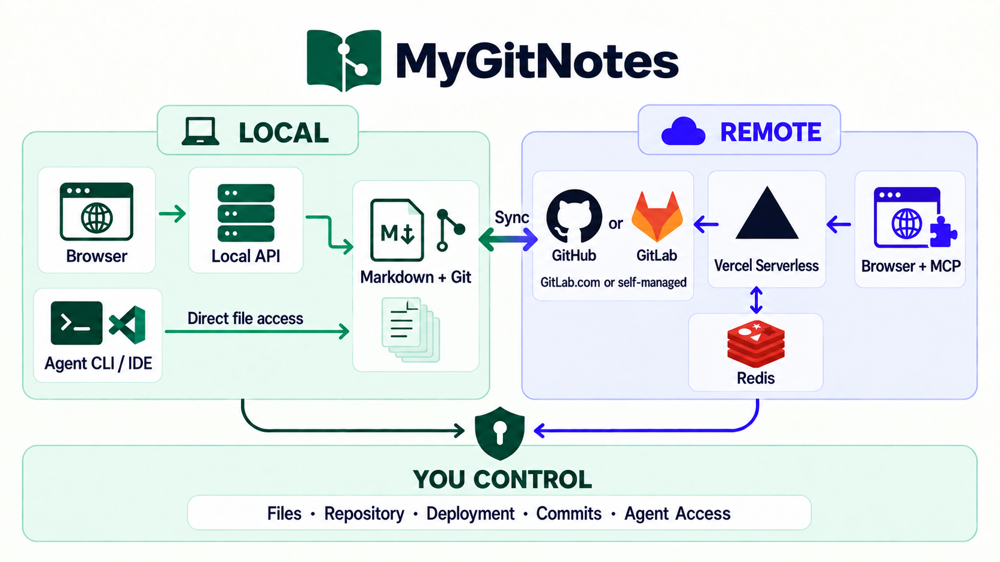

# MyGitNotes

A local-first workspace for Markdown notes, outlines, compilations, flashcards, and knowledge graphs, with a Pi agent beside your notes in local mode. Your content stays in Git; run the interface locally or deploy with Docker, Docker Compose, or Vercel.

[English](README.md) · [繁體中文](README.zh-TW.md)

[Live Demo](https://my-gh-core.vercel.app) · [Flashcard Demo](https://my-gh-core.vercel.app/notes/study?notebook=learning&path=notes%2Flearning%2F%E5%AD%B8%E7%BF%92-%E4%B8%80%E6%AC%A1%E4%B8%80%E5%BC%B5%E5%8D%A1%E7%89%87.compilation.yml) · [Example Workspace](https://github.com/wayne930242/MyGitNotes/tree/main)

## Why combine both sides

Local-first tools keep files on your device; cloud-document tools give you a browser and multi-device experience. MyGitNotes points both ways of working at the same Markdown and Git workspace. There is no second cloud copy to export, import, or reconcile.

## How it works

Markdown is the content source, Git records and publishes changes, and the repository owner controls credentials and access. A local checkout, Docker container, or Vercel deployment provides the interface and MCP endpoint; remote mode reads and writes the selected GitHub or GitLab repository.

One repository uses two branches in separate worktrees:

- **core** contains product source, packages, tests, scripts, and documentation.
- **main** contains workspace configuration, notebooks, assets, and workspace Agent settings.

## Quick start

Requires Node.js 22+, pnpm 9+, and Git 2.42+. Local mode needs no OAuth account.

~~~bash
git clone --branch core --single-branch https://github.com/wayne930242/MyGitNotes.git mygitnotes
cd mygitnotes
pnpm install
pnpm build                 # builds the packages the bootstrap script needs
pnpm bootstrap-workspace   # creates the main worktree in ./workspace (ignored by Git), writes MYGITNOTES_LOCAL_PATH to .env, and sets up the upstream remote
pnpm dev
~~~

Bootstrap renames the MyGitNotes remote from `origin` to `upstream` (or adds `upstream` when `origin` is already your repository), so `origin` can be your own repository while `pnpm update-core` keeps fetching Core from `upstream`. To keep your notes in your repository, create an empty one and push both branches:

~~~bash
git remote add origin <your-repository-url>
git push -u origin core main
~~~

Open http://localhost:5173; the new workspace appears in the Notes view.

Already have a workspace? Instead of bootstrap, run from the Core checkout:

~~~bash
pnpm link-workspace "/absolute/path/to/workspace"
pnpm dev
~~~

`link-workspace` validates the existing manifest and schema, then saves `MYGITNOTES_SOURCE=local` and the absolute `MYGITNOTES_LOCAL_PATH` in Core's `.env`, preserving unrelated settings.
It does not change notes or Git remotes, create worktrees, or migrate the workspace.
For an older schema, run `pnpm migrate-workspace --workspace "/absolute/path/to/workspace"` explicitly before linking; for a newer schema, update Core first.
An existing nonempty `REPO_ROOT` in `.env` follows the linked workspace too; an absent or empty value stays unchanged.
Shell environment settings still override `.env`.
`pnpm dev:remote` shares the same local workspace through Tailscale; it does not select a GitHub/GitLab source.
Both dev commands show `link-workspace` guidance if the workspace is missing.

## Deploy

The [deployment guide](docs/deploy.md) covers each path step by step:

- [Vercel through GitHub Actions sparse checkout](docs/deploy.md#vercel-through-github-actions-sparse-checkout-default) (default), or through the Vercel Git integration
- [Docker Compose](docs/deploy.md#docker-compose-with-a-remote-repository) or [plain Docker](docs/deploy.md#plain-docker-with-a-remote-repository) with a remote repository, optionally [behind a reverse proxy](docs/deploy.md#public-access-behind-a-reverse-proxy)
- [A local checkout inside a container](docs/deploy.md#local-checkout-inside-a-container)
- [GitLab as the note source](docs/deploy.md#gitlab-source-overlay)
- [Private R2 assets](docs/deploy.md#optional-private-r2-assets)

## Update

Run `pnpm update-core` from a clean `core` checkout; it fast-forwards `core` from `upstream/core`. Then `pnpm install && pnpm dev`. Hosted GitHub workspaces update from Settings. See [Core updates](docs/deploy.md#core-updates) and [Update and migrate](docs/deploy.md#update-and-migrate).

## Features

- Notes use ordinary Markdown with optional YAML frontmatter; Git preserves history and records explicit commits.
- Browse notes in List, Card, or Kanban views; search full text, manage folders and files, and explore a knowledge graph.
- [Compilations](#compilations) organize notebook content and replace the old Screen lanes; Markdown pages can also become flashcards.
- Local mode offers a [Pi agent](#pi-agent-local-mode) in the right panel, and [`pnpm dev:remote`](#use-it-from-other-devices-pnpm-devremote) opens the workspace from your other devices.
- Choose from **nine palette families**, each with light and dark variants. **Flexoki** is the default; choices are saved in the browser.
- Connect local agents through stdio or remote agents through Streamable HTTP MCP with named read-only or write grants.
- The Files page manages notebook folders, notes, text files, and attachments: 3 MiB uploads, 5 MiB reads and changes, up to 200 changed files per operation.

## Compilations

A compilation is a `<name>.compilation.yml` file in a notebook, tracked and synced by Git like a note.
Its members are picked by hand (notes, folders, attachments or YouTube videos) or gathered dynamically by tag or folder.
Dynamic compilations sort by updated time, created time, title or status, or by your own order.
They display as a card row (thumbnail, small, medium), a stack, or a graph; a card opens its note in zoom.
A compilation also keeps study settings for reading and reviewing its members; see the [study and flashcard guide](docs/agent/study.md).

The old Screen lanes are now compilations.
Running `pnpm migrate-workspace` on a schema 2 workspace turns each lane into a compilation and points Focus lane tabs at the new files.

## Outline notes

Use **New → New outline** to create a named `*.outline.md` note, or **Add to outline** from a note or compilation to insert its link into an existing or new outline.
A notebook can contain multiple outlines; find them under **Outlines** and edit them in the normal live/raw note editor.
Items can contain text, multiple optional Markdown links, annotations and children.
Enter adds a sibling, Shift+Enter adds an annotation, and Tab/Shift+Tab indent or promote a subtree.
The live editor also supports same-document drag handles and one-step undo; toolbar indentation works without a hardware keyboard, and Escape then Tab leaves the editor.
Deleting an item does not delete linked content.
HTTP(S) links open explicitly with opener isolation, without preview fetching.

Outlines use normal note saves and Changes: local saves write the worktree; remote saves stage browser drafts until you commit.
Managed moves update relative links together with the moved files, scoped to their repository.
Read-only and recovery behavior follows the normal editor.

### Legacy bookmark recovery and import

**New → Import legacy bookmarks** offers exact saved-source export and a read-only preview, including on read-only repositories.
Choose the repository, notebook, new title/path and entry IDs explicitly.
Note, compilation and safe web links can become outline items; old groups become text parents.
Positions, queries and folders remain in the original source with their IDs, labels and reasons shown.
Converting only the representable subset requires **partial import** acknowledgement.
Apply creates a new file only: a local worktree file or one remote commit, as the preview states.
Cancel writes nothing, and uncertain results require inspecting the original destination rather than automatic retry.

The original `.mygitnotes-bookmarks.yaml` is retained and protected; legacy editing and resolver endpoints are retired.
A workspace notice exposes pending browser envelopes from every configured repository, including unavailable repositories and malformed drafts.
Export preserves the exact envelope and its original base/revision; discard requires repository-specific confirmation and refuses a changed draft.
Legacy drafts never autosave, merge into saved source or enter normal Changes.
They remain a file-move blocker until explicitly discarded.

## Pi agent (local mode)

With [Pi](https://github.com/earendil-works/pi) installed, local mode adds an Agent tab to the right panel; the tab is hidden when `pi` (or the command in `MYGITNOTES_PI_COMMAND`) is not found.

- `pi --mode rpc` starts in the background when the workspace loads; after a page reload or a `pnpm dev` restart, the panel resumes the same conversation.
- Pi runs in an agent workspace: a folder with its own core instructions (`AGENTS.md`) and skills (`.agents/skills/`), set up on the Agents page.
  It starts at the repository root; click the workspace name in the header to switch, which ends the current conversation.
- MCP servers are configured in Pi itself (`pi mcp add`, or `/mcp` in the chat), never in the repository.
- Each message can name the open file: **Line** adds the caret line or selection, **Path only** adds just the path, and **None** adds nothing.
  Paths are relative to the folder Pi runs in.
- Switch the model and thinking level in the panel.
  Replies render as Markdown, links to notes open in the app, and questions Pi's extensions ask appear as cards in the conversation.
- When Pi changes a file on disk, the open editor updates at once.
  Unsaved edits are merged first; if they cannot be merged, the editor blocks and keeps your draft.
- Pi decides from `~/.pi/agent/trust.json` whether to load project settings.
  Buttons in the send row open its trust decision, MCP servers and extension status.

Pi runs as your local user and can run any command, so the agent accepts only local connections; through `pnpm dev:remote` it admits only the Tailscale login that owns this machine.
See the [security model](docs/agent/security/index.md).

## Use it from other devices (`pnpm dev:remote`)

`pnpm dev:remote` runs `pnpm dev` and shares it over HTTPS with Tailscale Serve, so a tablet or phone on the same tailnet can open it from another room.
It shares the same local workspace; it does not select a GitHub/GitLab source.
Other tailnet members can open the notes, while the Pi agent stays with the machine's owner; on a phone the agent takes the full screen.
If it does not connect, see [Remote access with Tailscale](#remote-access-with-tailscale) below.

## Documentation

- [Deployment guide](docs/deploy.md)
- [Agent and developer documentation](docs/agent/index.md)
- [Architecture](docs/agent/architecture/index.md)
- [MCP interface and security model](docs/agent/mcp/index.md)
- [Demo workspace](examples/demo-workspace/README.md)
- [Study and flashcard guide](docs/agent/study.md)

## License

The community edition is licensed under [AGPL-3.0](LICENSE). Contributions need the [Contributor License Agreement](CLA.md); see [CONTRIBUTING.md](CONTRIBUTING.md).

## Startup troubleshooting

### Workspace and pnpm

If startup reports a missing workspace, use `pnpm link-workspace "/absolute/path/to/workspace"` for existing notes.
Use `pnpm bootstrap-workspace` only when creating a workspace; it is not a repair command for an existing one.
A pnpm warning about its native executable, followed by successful fallback to the JavaScript CLI, is nonfatal.
If startup exits, check the subsequent error rather than treating that warning as the cause.

### Remote access with Tailscale

- **Same tailnet:** the server and browsing device must join the same tailnet.
  WSL and Windows may run separate Tailscale clients signed into different accounts or tailnets; check both.
- **DNS / `DNS_PROBE_FINISHED_NXDOMAIN`:** enable **Use Tailscale DNS settings** on the browsing device.
  Browser Secure DNS may bypass the system resolver; check the browser's resolver settings (`chrome://settings/security` in Chrome) so the tailnet hostname uses Tailscale DNS.
  Do not disable browser security globally.
- **Browser permission:** if a trusted site's browser prompt requests local-network access, choose **Allow local access**.
  If previously denied, review that site's local-network permission.
  This permission is separate from DNS resolution: granting it does not fix NXDOMAIN, and it is not Tailscale's exit-node LAN-access setting.
- **Serve activation / `node not found`:** ensure the browser's Tailscale admin console is signed into the server's tailnet.
  Check browser local-network permission only if prompted or blocked; it is not a proven universal cause of this message.
  In the correct tailnet, open [DNS settings](https://login.tailscale.com/admin/dns) → **HTTPS Certificates**, following the [official HTTPS instructions][tailscale-https].
- **`Access denied: serve config denied` on Linux/WSL:** an administrator can run the following once on the server to grant the current user local Tailscale management:

  ~~~bash
  sudo tailscale set --operator="$USER"
  ~~~

  This grants Tailscale management privileges to that user; do not run the entire `pnpm dev` or `pnpm dev:remote` command with sudo.
- **Lifecycle:** `dev:remote` runs Serve in the foreground; keep the command running while using the remote page.
  After changing tailnets, stop and rerun `pnpm dev:remote`, then open the newly printed URL rather than an old bookmark.

[tailscale-https]: https://tailscale.com/kb/1153/enabling-https
