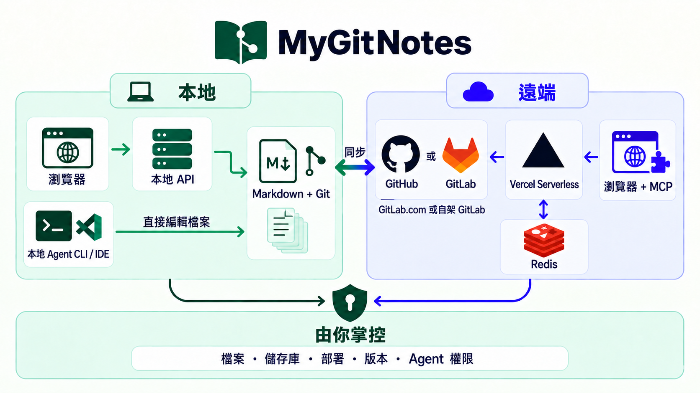

# MyGitNotes

以本機為主的 Markdown 工作區，整合筆記、單字卡、閱讀屏幕與知識圖譜。內容保存在 Git；可在本機使用，也能透過 Docker、Docker Compose 或 Vercel 部署。

[English](README.md) · [繁體中文](README.zh-TW.md)

[線上展示](https://my-gh-core.vercel.app) · [單字卡展示](https://my-gh-core.vercel.app/screen/lanes/explore) · [範例工作區](https://github.com/wayne930242/MyGitNotes/tree/main)

## 為什麼要把兩邊接起來

本機優先工具讓檔案留在自己的裝置；雲端文件工具則提供瀏覽器與多裝置體驗。MyGitNotes 讓兩種使用方式共用同一個 Markdown 與 Git 工作區。不需要匯出、匯入或對帳第二份雲端副本。

## 運作方式

Markdown 是內容來源，Git 記錄並發布變更，儲存庫擁有者管理憑證與存取權。介面與 MCP endpoint 可在本機、Docker 容器或 Vercel 執行；遠端模式讀寫指定的 GitHub 或 GitLab 儲存庫。

同一個儲存庫以兩個分支、兩個 worktree 管理：

- **core** 放置產品程式碼、套件、測試、腳本與文件。
- **main** 放置工作區設定、筆記本、素材與工作區 Agent 設定。

## 快速開始

需要 Node.js 22+、pnpm 9+ 與 Git 2.42+。本機模式不需要 OAuth 帳號。

~~~bash
git clone --branch core --single-branch https://github.com/wayne930242/MyGitNotes.git mygitnotes
cd mygitnotes
pnpm install
pnpm build                 # 建置 bootstrap 指令所需的套件
pnpm bootstrap-workspace   # 在 ./workspace 建立 main worktree（已被 Git 忽略）、將 MYGITNOTES_LOCAL_PATH 寫入 .env，並設定 upstream remote
pnpm dev
~~~

Bootstrap 會把 MyGitNotes 的 remote 從 `origin` 改名為 `upstream`（若 `origin` 已是你的儲存庫，則另外新增 `upstream`），讓 `origin` 留給你自己的儲存庫，`pnpm update-core` 則持續從 `upstream` 取得 Core。若要把筆記放在自己的儲存庫，建立一個空儲存庫並推送兩個分支：

~~~bash
git remote add origin <your-repository-url>
git push -u origin core main
~~~

開啟 http://localhost:5173，新建立的工作區會出現在筆記檢視。若要改用既有工作區，將 .env 的 `MYGITNOTES_LOCAL_PATH` 設為它的絕對路徑，或執行 `REPO_ROOT=/absolute/path/to/workspace pnpm dev`。

## 部署

[部署指南](docs/deploy.zh-TW.md)逐步說明各種方式：

- [透過 GitHub Actions sparse checkout 部署至 Vercel](docs/deploy.zh-TW.md#透過-github-actions-sparse-checkout-部署至-vercel預設)（預設），或透過 Vercel Git integration
- 以 [Docker Compose](docs/deploy.zh-TW.md#docker-compose-連接遠端儲存庫) 或 [Docker](docs/deploy.zh-TW.md#docker-連接遠端儲存庫) 連接遠端儲存庫，可再加上 [reverse proxy](docs/deploy.zh-TW.md#公開連線使用-reverse-proxy)
- [在容器中開啟本機 checkout](docs/deploy.zh-TW.md#在容器中開啟本機-checkout)
- [以 GitLab 作為筆記來源](docs/deploy.zh-TW.md#gitlab-來源設定)
- [私有 R2 素材](docs/deploy.zh-TW.md#選用私有-r2-素材)

## 更新

在乾淨的 `core` checkout 執行 `pnpm update-core`，它會從 `upstream/core` fast-forward `core`；再執行 `pnpm install && pnpm dev`。部署在遠端的 GitHub 工作區可從「設定」頁更新。詳見 [Core 更新](docs/deploy.zh-TW.md#core-更新)與[更新與遷移](docs/deploy.zh-TW.md#更新與遷移)。

## 功能

- 筆記採用一般 Markdown 與選用的 YAML frontmatter；Git 保存歷程並記錄明確提交的變更。
- 以清單、卡片或看板瀏覽筆記；可全文搜尋、管理資料夾與檔案，並探索知識圖譜。
- Screen 河道整理筆記本內容；Markdown 分頁也能轉成單字卡複習。
- 提供 **九組主題配色**，各有淺色與深色版本；預設為 **Flexoki**，選擇會保存在瀏覽器。
- Agent 可透過本機 stdio 或遠端 Streamable HTTP MCP 連線，並使用具名唯讀或寫入授權。
- 「檔案」頁可管理筆記本資料夾、筆記、文字檔與附件：上傳上限 3 MiB，讀取與修改上限 5 MiB，每次操作最多 200 個異動檔案。

## 文件

- [部署指南](docs/deploy.zh-TW.md)
- [Agent 與開發者文件](docs/agent/index.md)
- [架構說明](docs/agent/architecture/index.md)
- [MCP 介面與安全模型](docs/agent/mcp/index.md)
- [示範工作區](examples/demo-workspace/README.md)
- [學習與單字卡指南](docs/agent/study.md)

## 授權條款

MIT
