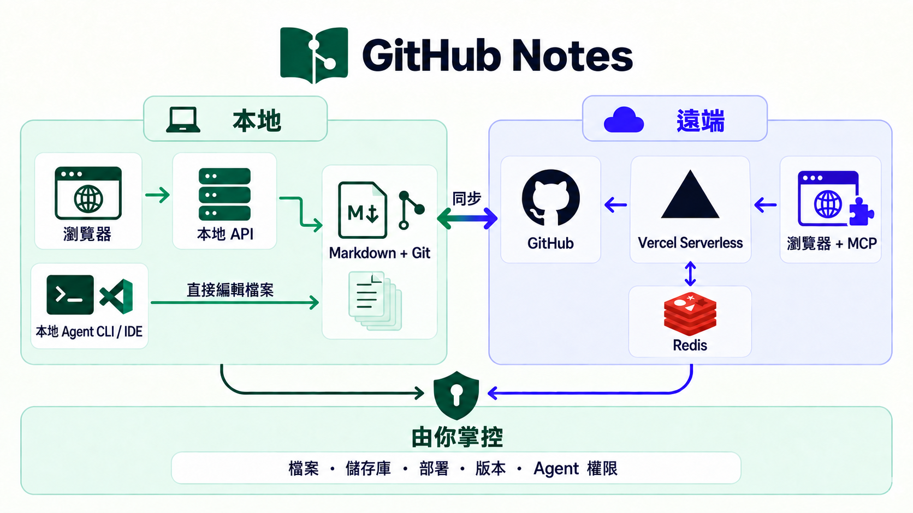

# GitHub Notes

一個高密度、功能集中的本地優先文件介面；以 Git 原生保存資料，並透過 GitHub 與 Vercel 提供可遠端存取的 serverless MCP。

Markdown、儲存庫、部署、版本歷史與 Agent 存取權，全都由使用者掌控。

[English](README.md) · [繁體中文](README.zh-TW.md)

[線上展示](https://my-gh-core.vercel.app) · [範例儲存庫](https://github.com/wayne930242/github-notes/tree/main)

## 這是什麼

GitHub Notes 把一個 Git 儲存庫變成集中處理筆記、文件、素材與 AI Agent 的工作區。你使用專為筆記設計的介面工作，而 Markdown 檔案、Git 歷史與儲存庫權限始終是資料的最終依據。

它有兩種運作模式：

- **本地模式：**介面直接讀寫本機儲存庫。
- **遠端模式：**Vercel 提供介面與 serverless MCP 端點，GitHub 保存檔案與 commit 歷史。

因此，同一個工作區可以完全留在本機、透過 Git 在裝置間移動，也能讓瀏覽器與 MCP 用戶端安全地遠端存取，不必自行維護常駐伺服器。

## 核心功能

- **高密度筆記介面：**清單、卡片與看板檢視；全文搜尋；標籤與狀態；巢狀資料夾；資料夾索引卡；Markdown 編輯與即時預覽；素材管理；桌面與行動裝置響應式版面。
- **屏幕：**把不同筆記本的筆記、資料夾、圖片與 YouTube 影片排進閱讀泳道；動態泳道可依標籤或資料夾自動收集內容。
- **純 Markdown：**筆記是一般 `.md` 檔，可選用 YAML frontmatter。既有 Markdown 與未知 metadata 在讀寫後仍會保留。
- **Git 原生工作流：**本地編輯先寫入磁碟，再由你明確選取並提交。遠端寫入使用 revision 檢查與非強制 commit，拒絕覆蓋過期版本。
- **本地與遠端來源：**用同一套介面開啟本機 checkout 或指定的 GitHub 儲存庫。
- **本地與託管 MCP：**Agent 可透過本地 stdio 或 Vercel 託管的 Streamable HTTP，列出、讀取、搜尋、建立、編輯、移動與提交工作區內容。
- **可控的 Agent 權限：**建立具名的唯讀或寫入授權；連線網址只顯示一次，任何授權都能隨時個別撤銷。
- **安全的產品更新：**產品程式碼放在 `core`，個人工作區放在 `main`；更新 Core 時保留 `notes/**` 與工作區自己的 Agent 設定。

## 設計邏輯



各層的責任刻意分開：

- **Markdown 掌管內容。**沒有需要匯出的專有筆記資料庫。
- **Git 掌管歷史與發布。**你決定提交哪些變更，也能檢查或還原每一次修改。
- **GitHub 掌管遠端保存。**Vercel 只提供介面與 serverless 傳輸；Redis 保存 session 與 MCP 授權，不保存筆記。
- **使用者掌管系統邊界。**儲存庫、分支、部署、憑證、Core 更新與每一筆 Agent 授權都由你決定。
- **介面與 Agent 遵守同一套規則。**路徑限制、分支限制、revision 檢查與儲存庫權限同時約束兩者。

## 為什麼要把兩邊接起來

市面上的筆記工具通常把這兩種路線當成不同的產品模型：

- **像 [Obsidian](https://obsidian.md/blog/free-your-notes/) 的本地優先：**一般檔案保存在自己的裝置上，可離線使用，也能直接透過 IDE、CLI 或本地 Agent 編輯。
- **像 [Craft](https://support.craft.do/en/account-and-subscription/data-and-security/data-storage)／[Notion](https://www.notion.com/help/notion-for-web) 的雲端文件：**提供完整的瀏覽器與多裝置體驗，以及自動同步、分享和遠端協作。

即使同一產品支援兩種模式，通常也只是二選一。以 Craft 為例，它支援本地 [External Locations](https://support.craft.do/en/account-and-subscription/storage-and-recovery/external-locations)，但該模式不提供內建分享與協作。

GitHub Notes 則把兩種介面接到同一個 Markdown 與 Git 工作區。本地 UI 和本地 Agent 直接編輯檔案；Git 將內容同步到 GitHub；Vercel 再以同一個儲存庫提供高密度遠端筆記介面與 serverless MCP。不需要匯出、匯入或對帳第二份雲端副本。

## 儲存庫模型

- **`core`**：產品原始碼、套件、測試、指令稿與說明文件，不包含個人筆記。
- **`main`**：你的工作區分支，包含 `.github-notes.yaml`、`notes/**`、素材與工作區 Agent 設定。

這個分離讓產品可以持續更新，卻不取得你內容的所有權。

## 快速開始

需要 Node.js 22+、pnpm 9+ 與 Git。

```bash
git clone <repository-url> github-notes
cd github-notes
pnpm install
pnpm build
pnpm bootstrap-workspace
pnpm dev
```

開啟 [http://localhost:5173](http://localhost:5173)。開發指令直接使用本機儲存庫，不需要登入 GitHub。

若要開啟另一個 checkout：

```bash
REPO_ROOT=/absolute/path/to/workspace pnpm dev
```

若要從產品分支更新既有工作區：

```bash
git remote add upstream <product-repository-url>
pnpm update-core
```

## 遠端部署與 serverless MCP

將 `main` 分支部署到你自己的 Vercel 專案。隨附的 [`vercel.json`](vercel.json) 會建置網頁介面，並將 `/api/*`、`/mcp/*` 與 `/raw-assets/*` 導向 serverless API。

你需要：

1. GitHub OAuth App，callback URL 設為 `https://<your-project>.vercel.app/api/auth/github/callback`。
2. Upstash Redis，用來保存加密的瀏覽器 session 與持久 MCP 授權。
3. 以下 Vercel 環境變數：

```bash
GITHUB_NOTES_SOURCE=github
GITHUB_NOTES_REPOSITORY=your-username/your-repository
GITHUB_NOTES_BRANCH=main

APP_URL=https://<your-project>.vercel.app
GITHUB_CLIENT_ID=your_oauth_client_id
GITHUB_CLIENT_SECRET=your_oauth_client_secret
GITHUB_APP_TYPE=oauth-app
SESSION_SECRET=your_random_secret_of_at_least_32_characters

UPSTASH_REDIS_REST_URL=https://...upstash.io
UPSTASH_REDIS_REST_TOKEN=your_upstash_redis_token
```

部署後以 GitHub 登入，在「**設定 → MCP 存取控制**」建立唯讀或寫入授權，再把產生的 `/mcp/<token>` 網址貼到 ChatGPT、Claude、Cursor、Windsurf 或其他 MCP 用戶端。

標準 GitHub OAuth App 會要求 `repo` scope，讓通過驗證的擁有者讀寫私人儲存庫。MCP 授權只適用於指定的儲存庫，並可逐一撤銷。

## 說明文件

- [Agent 與開發者說明](docs/agent/index.md)
- [系統架構](docs/agent/architecture/index.md)
- [MCP 介面與安全模型](docs/agent/mcp/index.md)
- [展示工作區](examples/demo-workspace/README.md)

## 授權

MIT
