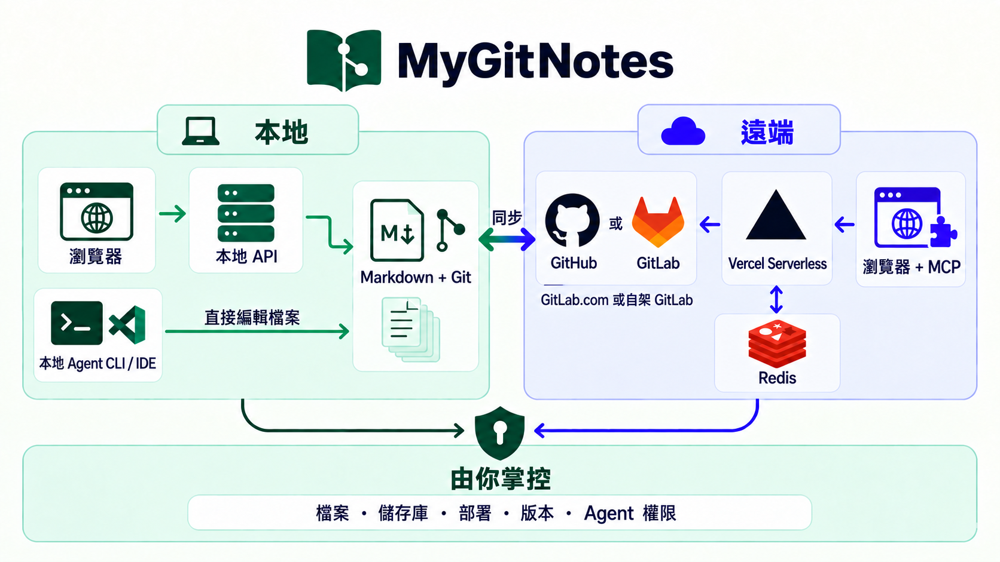

# MyGitNotes

以本機為主的 Markdown 工作區，整合筆記、單字卡、閱讀屏幕與知識圖譜。內容保存在 Git；可在本機使用，也能透過 Docker、Docker Compose 或 Vercel 部署。

[English](README.md) · [繁體中文](README.zh-TW.md)

[線上展示](https://my-gh-core.vercel.app) · [單字卡展示](https://my-gh-core.vercel.app/screen/lanes/explore) · [範例工作區](https://github.com/wayne930242/MyGitNotes/tree/main)

## 為什麼要把兩邊接起來

本機優先工具讓檔案留在自己的裝置；雲端文件工具則提供瀏覽器與多裝置體驗。MyGitNotes 讓兩種使用方式共用同一個 Markdown 與 Git 工作區。不需要匯出、匯入或對帳第二份雲端副本。

## 運作方式

Markdown 是內容來源，Git 記錄並發布變更，儲存庫擁有者管理憑證與存取權。介面與 MCP endpoint 可在本機、Docker 容器或 Vercel 執行；遠端模式讀寫指定的 GitHub 或 GitLab 儲存庫。

同一個儲存庫以兩個分支、兩個 worktree 管理：

- **core** 放置產品程式碼、套件、測試、腳本與文件。
- **main** 放置工作區設定、筆記本、素材與工作區 Agent 設定。

## 快速開始

需要 Node.js 22+、pnpm 9+ 與 Git 2.42+。本機模式不需要 OAuth 帳號。

~~~bash
git clone --branch core --single-branch https://github.com/wayne930242/MyGitNotes.git mygitnotes
cd mygitnotes
pnpm install
pnpm build                 # 建置 bootstrap 指令所需的套件
pnpm bootstrap-workspace   # 在 ./workspace 建立 main worktree（已被 Git 忽略）、將 MYGITNOTES_LOCAL_PATH 寫入 .env，並設定 upstream remote
pnpm dev
~~~

Bootstrap 會把 MyGitNotes 的 remote 從 `origin` 改名為 `upstream`（若 `origin` 已是你的儲存庫，則另外新增 `upstream`），讓 `origin` 留給你自己的儲存庫，`pnpm update-core` 則持續從 `upstream` 取得 Core。若要把筆記放在自己的儲存庫，建立一個空儲存庫並推送兩個分支：

~~~bash
git remote add origin <your-repository-url>
git push -u origin core main
~~~

開啟 http://localhost:5173，新建立的工作區會出現在筆記檢視。

已有工作區時，不需要 bootstrap；改在 Core checkout 執行：

~~~bash
pnpm link-workspace "/absolute/path/to/workspace"
pnpm dev
~~~

`link-workspace` 會驗證既有 manifest 與 schema，再將 `MYGITNOTES_SOURCE=local` 及絕對路徑 `MYGITNOTES_LOCAL_PATH` 寫入 Core 的 `.env`，保留其他設定。
它不會修改筆記或 Git remote、建立 worktree，也不會遷移工作區。
若 schema 較舊，先明確執行 `pnpm migrate-workspace --workspace "/absolute/path/to/workspace"` 再連結；若較新，則先更新 Core。
若 `.env` 已有非空的 `REPO_ROOT`，也會同步指向連結的工作區；未設定或空值則保持不變。
Shell 環境變數仍優先於 `.env`。
`pnpm dev:remote` 透過 Tailscale 分享同一個本機工作區，不會切換成 GitHub/GitLab 來源。
兩個 dev 指令都會在缺少工作區時顯示 `link-workspace` 操作指引。

## 部署

[部署指南](docs/deploy.zh-TW.md)逐步說明各種方式：

- [透過 GitHub Actions sparse checkout 部署至 Vercel](docs/deploy.zh-TW.md#透過-github-actions-sparse-checkout-部署至-vercel預設)（預設），或透過 Vercel Git integration
- 以 [Docker Compose](docs/deploy.zh-TW.md#docker-compose-連接遠端儲存庫) 或 [Docker](docs/deploy.zh-TW.md#docker-連接遠端儲存庫) 連接遠端儲存庫，可再加上 [reverse proxy](docs/deploy.zh-TW.md#公開連線使用-reverse-proxy)
- [在容器中開啟本機 checkout](docs/deploy.zh-TW.md#在容器中開啟本機-checkout)
- [以 GitLab 作為筆記來源](docs/deploy.zh-TW.md#gitlab-來源設定)
- [私有 R2 素材](docs/deploy.zh-TW.md#選用私有-r2-素材)

## 更新

在乾淨的 `core` checkout 執行 `pnpm update-core`，它會從 `upstream/core` fast-forward `core`；再執行 `pnpm install && pnpm dev`。部署在遠端的 GitHub 工作區可從「設定」頁更新。詳見 [Core 更新](docs/deploy.zh-TW.md#core-更新)與[更新與遷移](docs/deploy.zh-TW.md#更新與遷移)。

## 功能

- 筆記採用一般 Markdown 與選用的 YAML frontmatter；Git 保存歷程並記錄明確提交的變更。
- 以清單、卡片或看板瀏覽筆記；可全文搜尋、管理資料夾與檔案，並探索知識圖譜。
- Screen 河道整理筆記本內容；Markdown 分頁也能轉成單字卡複習。
- 提供 **九組主題配色**，各有淺色與深色版本；預設為 **Flexoki**，選擇會保存在瀏覽器。
- Agent 可透過本機 stdio 或遠端 Streamable HTTP MCP 連線，並使用具名唯讀或寫入授權。
- 「檔案」頁可管理筆記本資料夾、筆記、文字檔與附件：上傳上限 3 MiB，讀取與修改上限 5 MiB，每次操作最多 200 個異動檔案。

## 大綱筆記

從新增選單選擇「新增大綱」，即可建立具名的 `*.outline.md` 筆記。
也可在筆記或合輯中選擇「加入大綱」，將目前內容的連結插入既有或新建的大綱。
每個筆記本可以保存多份大綱，透過側欄「大綱」瀏覽，並使用一般筆記的即時／原始碼編輯器。
每個項目都可以包含文字、多個 Markdown 連結、註記與子項目。
Enter 新增同層項目，Shift+Enter 新增同項註記，Tab／Shift+Tab 調整整個子樹的階層。
即時編輯器也可拖曳移動同份大綱的項目，並以一次復原還原；沒有鍵盤時可使用工具列縮排，按 Escape 再按 Tab 可離開編輯器。
刪除項目不會刪除連結指向的內容。
HTTP(S) 連結只在使用者開啟時另開分頁，隔離原分頁存取權限，不會預先抓取預覽。

大綱沿用一般筆記的儲存與變更流程：本機儲存寫入工作目錄；遠端儲存先保留瀏覽器草稿，明確提交後才寫入儲存庫。
經 MyGitNotes 搬移檔案時，會在同次操作中更新所屬儲存庫內的相對連結。
唯讀與草稿復原行為沿用一般編輯器。

### 舊書籤復原與匯入

新增選單中的「匯入舊書籤」可匯出已保存來源的原始內容，並預覽轉換結果；唯讀儲存庫也能使用這兩項功能。
請明確選擇儲存庫、筆記本、新標題與路徑，以及項目 ID。
筆記、合輯與安全的網站連結可轉成大綱項目，舊群組則轉成文字父項目。
精確位置、查詢與資料夾項目保留於原始來源，預覽會列出 ID、標籤及原因。
僅轉換可呈現的部分內容時，必須確認「部分匯入」。
套用只會建立新檔案：本機建立工作目錄檔案，遠端建立一筆提交，確認前會明確說明。
取消不會寫入；結果不明時應先檢查原本指定的目標，系統不會自動重試。

原始 `.mygitnotes-bookmarks.yaml` 會保留並繼續受到保護，舊書籤編輯與解析端點已停用。
工作區通知會列出所有已設定儲存庫的待復原瀏覽器草稿，包含目前不可用的儲存庫與格式損壞的草稿。
匯出保留完整原始資料及原來的基底／版本；捨棄需確認儲存庫 ID，草稿已變更時會拒絕刪除。
舊草稿不會自動儲存、合併到已保存來源，也不會加入一般變更清單。
明確捨棄前，檔案搬移仍會被阻擋。

## 文件

- [部署指南](docs/deploy.zh-TW.md)
- [Agent 與開發者文件](docs/agent/index.md)
- [架構說明](docs/agent/architecture/index.md)
- [MCP 介面與安全模型](docs/agent/mcp/index.md)
- [示範工作區](examples/demo-workspace/README.md)
- [學習與單字卡指南](docs/agent/study.md)

## 授權條款

MIT

## 啟動疑難排解

### 工作區與 pnpm

若啟動時顯示缺少工作區，已有筆記請使用 `pnpm link-workspace "/absolute/path/to/workspace"`。
`pnpm bootstrap-workspace` 用來建立工作區，不是修復既有工作區的指令。
若 pnpm 顯示原生執行檔警告，之後成功改用 JavaScript CLI 繼續執行，該警告不會阻止啟動。
若程序退出，請查看後續錯誤，不要直接將這項警告當作原因。

### 透過 Tailscale 遠端連線

- **同一個 tailnet：** 伺服器與開啟瀏覽器的裝置必須加入同一個 tailnet。
  WSL 與 Windows 可能各自執行 Tailscale client，登入不同帳號或 tailnet；兩邊都要確認。
- **DNS／`DNS_PROBE_FINISHED_NXDOMAIN`：** 在開啟瀏覽器的裝置啟用 **Use Tailscale DNS settings**。
  瀏覽器的 Secure DNS 可能略過系統解析器；請檢查瀏覽器的 DNS 設定（Chrome 為 `chrome://settings/security`），讓 tailnet 主機名稱透過 Tailscale DNS 解析。
  不需要全域關閉瀏覽器安全功能。
- **瀏覽器權限：** 若信任的網站跳出區域網路存取提示，請選 **Allow local access**。
  若之前拒絕過，請檢查該網站的區域網路存取權限。
  這項權限與 DNS 解析分開：允許存取不會修復 NXDOMAIN，也不是 Tailscale 的 exit-node LAN-access 設定。
- **Serve 啟用／`node not found`：** 確認瀏覽器中的 Tailscale 管理介面登入的是伺服器所屬的 tailnet。
  只有出現提示或被封鎖時，才檢查瀏覽器的區域網路權限；不能把它當作這個訊息的通用原因。
  在正確的 tailnet 開啟 [DNS 設定](https://login.tailscale.com/admin/dns) → **HTTPS Certificates**，依[官方 HTTPS 說明][tailscale-https]操作。
- **Linux／WSL 出現 `Access denied: serve config denied`：** 管理者可在伺服器執行一次以下指令，授予目前使用者本機 Tailscale 管理權限：

  ~~~bash
  sudo tailscale set --operator="$USER"
  ~~~

  這會授予該使用者 Tailscale 管理權限；不要用 sudo 執行整個 `pnpm dev` 或 `pnpm dev:remote`。
- **程序生命週期：** `dev:remote` 以前景模式執行 Serve，使用遠端頁面時請保持指令執行。
  切換 tailnet 後，先停止再重新執行 `pnpm dev:remote`，開啟新印出的網址，不要沿用舊書籤。

[tailscale-https]: https://tailscale.com/kb/1153/enabling-https
